<p align="center">
  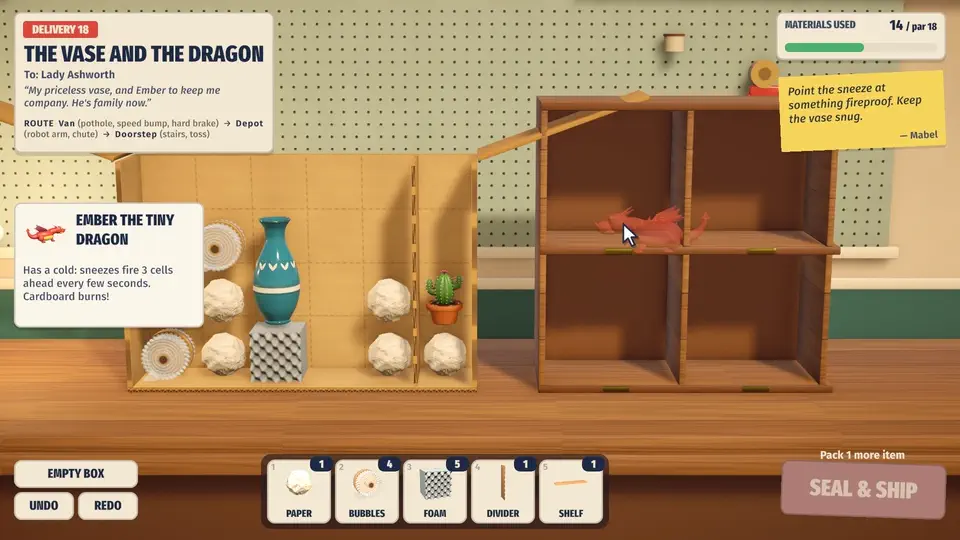
</p>

<h1 align="center">Handle With Care</h1>

<p align="center"><b>Pack bizarre deliveries so they survive a journey you get to watch afterward.</b></p>

<p align="center">
  
  
  
  
  
</p>

<p align="center">
  <a href="docs/media/trailer.mp4">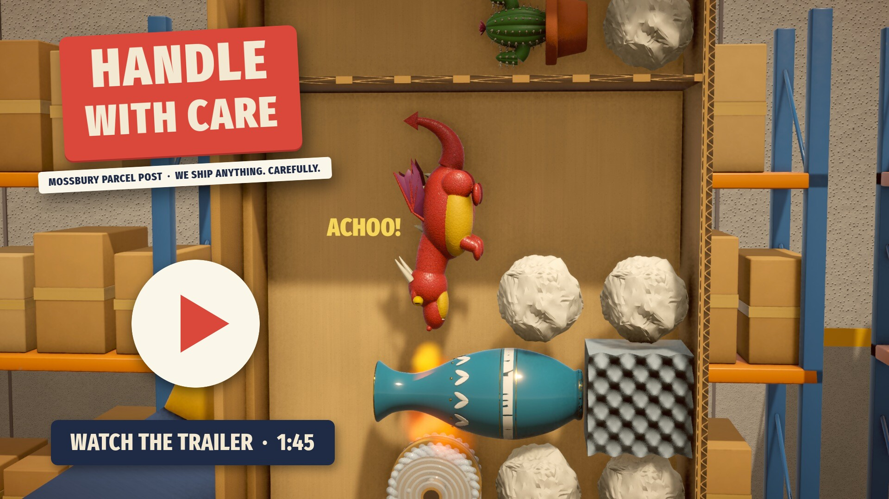</a>
  <br><sub>▶ 1:39 feature trailer (MP4, 35 MB): click the poster, or <a href="docs/media/trailer.mp4?raw=true">download the video</a>.</sub>
</p>

---

## About

You are the newest packer at the **Mossbury Parcel Post**, the only courier in town that will ship
*anything*: a teacup that has survived three wars and one cat, Snoozles the armadillo (do not wake
him), two magnets that must never meet, a potion that has to stay upright, a birthday balloon next to
a cactus, and Ember, a tiny dragon with a cold.

Pack each order into a cardboard box with paper, bubble wrap, foam, dividers, shelves and straps.
Seal it with a long screech of tape. Then sit back and watch the parcel ride a delivery truck, a
sorting depot, a careless courier, a ferry, a cargo plane and a catapult. At the other end the
customer opens the box on their kitchen table, and every item comes out with a rubber stamp:
**PERFECT**, **SHATTERED**, **WIDE AWAKE**, **SPILLED**, **MELTED**, **POPPED**, **BOX ON FIRE**...

The journey is a deterministic physics simulation, so every failure is fair, readable and fixable:
watch the replay, see exactly where the vase went over, and repack.

## How to play

Pick an item off the shelf, drop it in the box, paint padding around it, seal, and watch.

| Input | Action |
| --- | --- |
| Left click an item on the shelf | Pick it up (hover first to read its card: quirk and jolt limit) |
| Left click in the box | Drop the held item; it slides down to the first spot it can rest on |
| `1` – `6`, or click the toolbar | Paper, bubble wrap, foam, divider, shelf, strap |
| Left drag (padding) | Paint padding into every cell you sweep over |
| Right drag (padding) | Erase padding |
| `R`, right click or mouse wheel | Rotate the held piece, or turn a creature or dragon to face the other way |
| Left click a placed piece | Pick it back up |
| Right click a placed piece | Return it to the shelf (items) or bin it (padding) |
| Click a divider or shelf (with that tool) | Remove it |
| `Z` / `Y` (or `Shift`+`Z`) | Undo / redo (the keys labelled Z and Y, so QWERTZ and AZERTY keyboards work too) |
| MY BEST (above EMPTY BOX) | Put your best packing of this delivery back in the box (`Z` undoes it) |
| `Space` / `Enter` | Seal & ship, once every item is packed |
| ASK MABEL (under her note) | After a trip that missed a star: one more hint per click |
| `Esc` | Drop what you are holding, or pause; in Settings, the delivery log and the credits, go back |
| During the journey | `Space` pause, `Enter` skip, `1`–`4` playback speed |
| Replay | Click the timeline to jump, speed buttons, `C` or the CAM button cycles director / close-up / wide |
| Unboxing | `Enter`, `Space` or `Esc` skips to the review |
| Review | `R` repack, `P` replay, `Enter` next delivery |

**Gamepad (and Steam Deck).** Pick up a controller and a cursor appears: the left stick moves it,
the d-pad jumps it to the next box cell, item or button. Everything the mouse does works the same. The
on-screen hints and Mabel's tutorial notes switch to gamepad buttons while you use one: Xbox letters, or
the PlayStation shapes (cross, circle, square, triangle, L1/R1, L2/R2, OPTIONS, SHARE or CREATE) with a
DualShock or DualSense. If a pad shows the wrong ones, Settings > GAMEPAD BUTTON ICONS picks them.

| Gamepad | Action |
| --- | --- |
| Left stick / d-pad | Move the cursor / jump to the next cell, shelf item or button |
| A | Click: pick up, drop, hold to paint padding, press buttons |
| B | Right click: erase padding, put a piece back, or put back the item in hand; back out of menus (like `Esc`) |
| X / Y | Rotate the held piece / Ask Mabel |
| LB / RB | Previous / next material |
| LT / RT | Undo / redo |
| View | Seal & ship |
| Start | Put down the material in hand, or pause |
| During the journey | A pause, B skip, X speed, Y camera |
| Unboxing / review | A or B skip / X repack, Y replay, A on NEXT |

There is no touch support.

## Features

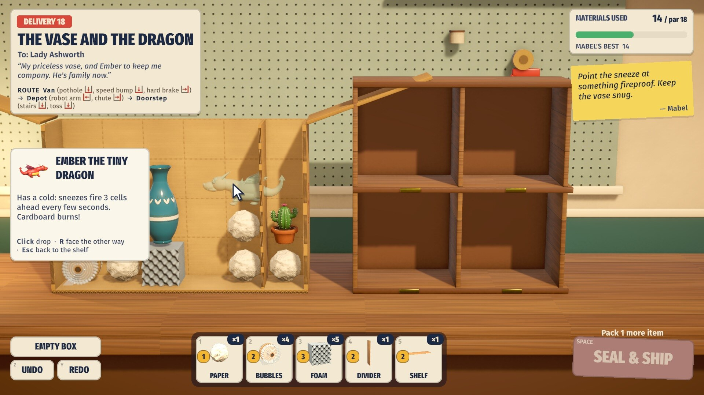

**Spatial packing with personality.** Everything sits on a grid and has to rest on something
(balloons rest against the ceiling). Each of the 19 kinds of item has a quirk on its card. Fragile
things break above their jolt limit, and tall things topple unless something is beside their
shoulders. Snoozles rolls over in his sleep and wakes up on a hard knock. Magnets pull each other
from four cells away and stick for good. Nothing heavier than padding may sit on a cake. Balloons
float, and cacti pop them. Clank the robot marches until something stops him. The ice swan melts
near the lava lamp, the bouncy ball never loses its energy, and the frog hops every few seconds.
Ember sneezes fire three cells ahead. While you pack, quirk previews show where a sneeze will reach,
which magnets will pull on each other, how far heat spreads and who is asleep.

**Padding, dividers, shelves and straps.** Paper is cheap and a little soft, bubble wrap is softer
(and pops on spikes), foam is softest and fireproof. Dividers wall things off and block heat, shelves
take the weight off a cake, and straps pin an item in place (until a strap snaps). Every material costs money:
stay at or under par for a star.

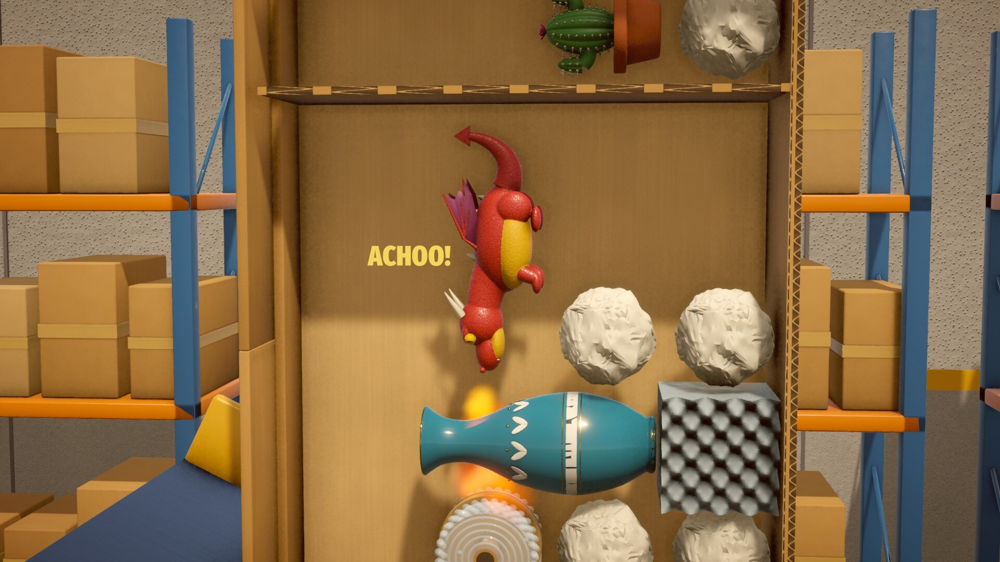

**Ask Mabel.** After a trip that missed a star, Mabel will help if you ask. The first hint is a note
about the item at risk (where it sits in her packing and what is beside it). The next ones show that
item's exact spot as a ghost in the box, then her dividers and shelves, then her whole packing. Hints
never cost stars; the delivery log just pencils in "hinted".

**Watch the trip.** Seal the box and the journey plays out with a director camera that knows the
future: it slows down and leans in just before something goes wrong, and shakes on the big hits.
Every bump the box takes (brake, pothole, cobbles, belt drop, robot arm, chute, stairs, a courier's
toss, waves, an air pocket, a catapult launch) is exactly what the contents feel.

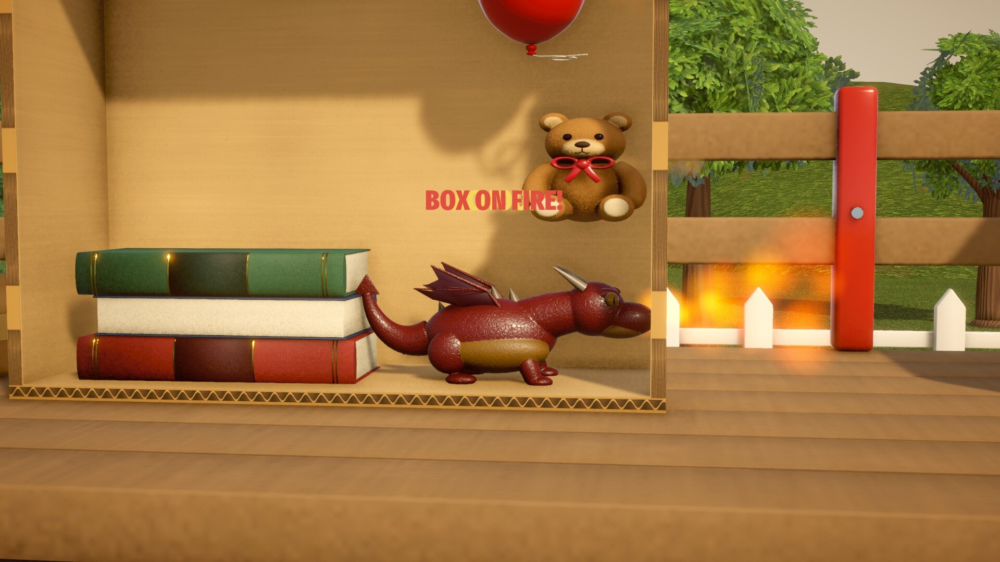

**Funny failures you can fix.** Fragile things shatter into shard piles, cakes go SPLAT, potions
spill, balloons go BANG in a burst of confetti, and if Ember's sneeze reaches cardboard, the box
catches fire. Then the replay lets you scrub the trip in close-up. Back at the bench, the
last trip's trails show where every item went and mark where things went wrong ("Vase shattered at
the hard brake, jolt 11/8").

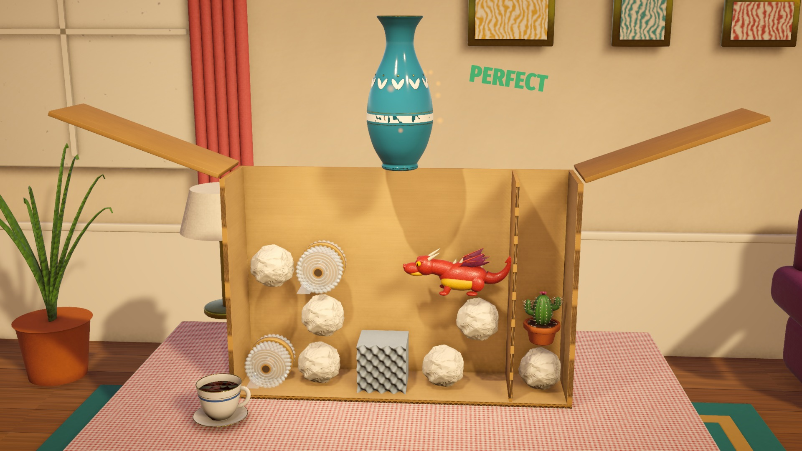

**The unboxing.** At the other end, the box lands on the customer's kitchen table, the tape is
sliced, the flaps burst open and each item rises into the light to get its stamp. The second time
you open the same delivery, the unboxing plays at double speed (except for the dragon egg). Then the review
and up to three stars:

- **Delivered**: every item arrives OK.
- **Under budget**: materials cost at or below par.
- **Handled with care**: no item ever went above 65% of its limit, and nothing toppled.

Stars add up across attempts and unlock six tape designs: Kraft, Candy Stripe, Teal Polka, FRAGILE,
Dragon Scale and Gold. For the stubborn there is also **Mabel's best**: the cheapest three-star packing
the solver has found for each delivery, shown under the materials meter. Match it with three stars
and the delivery log stamps the order EXPERT.

## Content

Twenty handcrafted deliveries over four shifts, each one introducing a new idea, then five more in
Overtime, which opens when the credits roll:

| Shift | Journey | Deliveries |
| --- | --- | --- |
| 1 · First Day | Truck on a country road | A Cup for Edna (tutorial), Bookends, The Tall Vase, Strike!, Snoozles |
| 2 · The Sorting Depot | Truck, then conveyors, a drop, a robot arm and a chute | Opposites Attract, Potion Commotion, Happy Birthday Timmy, A Prickly Situation, Magnetic Personality |
| 3 · Last Mile | Depot or truck, then Dash the courier, the porch stairs and a toss | Clockwork Clank, Swan Song, Boing, Hoppy Delivery, Ember |
| 4 · Express Service | Ferry, cargo plane and catapult | High Seas, Air Pocket, The Vase and the Dragon, Museum Piece, The Dragon Egg |
| 5 · Overtime | Every route so far, mixed | Fire and Ice, Party Animal, Let Them Eat Cake, A Warm Welcome, Moving Day |

Overtime puts together quirks the story never shares a box: Ember beside an ice swan, a hopping frog
with a balloon, Clank loose with a cake, a dragon egg kept warm by the lava lamp on a rolling ferry,
and Mabel's own house move by catapult. Like the rest, each one is proven solvable with three stars,
and random item-only packings never get through.

That's 19 item types, 3 kinds of padding plus dividers, shelves and straps, and six journey
environments. There's also an onboarding tutorial and shift title cards, plus a delivery log
(point at a card to see which of its three stars is missing, your best cost against par and your
best care against the 65% line), settings (volumes, screen shake, reduced motion, packing grid, gamepad button icons, larger
text, fullscreen or a window size, VSync and a frame-rate limit, a graphics quality switch, pausing when
the window loses focus, and starting over), pause, and a replay with three camera modes.

Progress is saved as you go, including a box you haven't sealed yet: leave for the menu or quit, and
it's on the bench when you come back. Saves are written to a temporary file and swapped in, with the
previous one kept as a backup. If the save is ever damaged, the game loads the backup, keeps the
damaged file, and Mabel leaves a note on the title screen saying so.

Each delivery also keeps your best packing (most stars, then cheapest, then gentlest), so chasing
Mabel's best never costs you a three-star layout: **MY BEST** on the bench brings it back. (Coming
from v0.1.0, the last box you shipped for each delivery becomes MY BEST, if it still delivers.)
**Start over** in Settings clears the progress and keeps your settings. It asks first, and the old
save stays on disk as `save.erased-<date>.json`.

## Screenshots

| | |
| --- | --- |
| 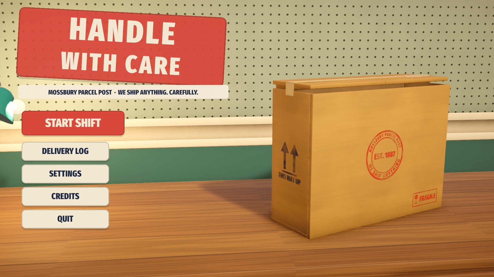 |  |
| 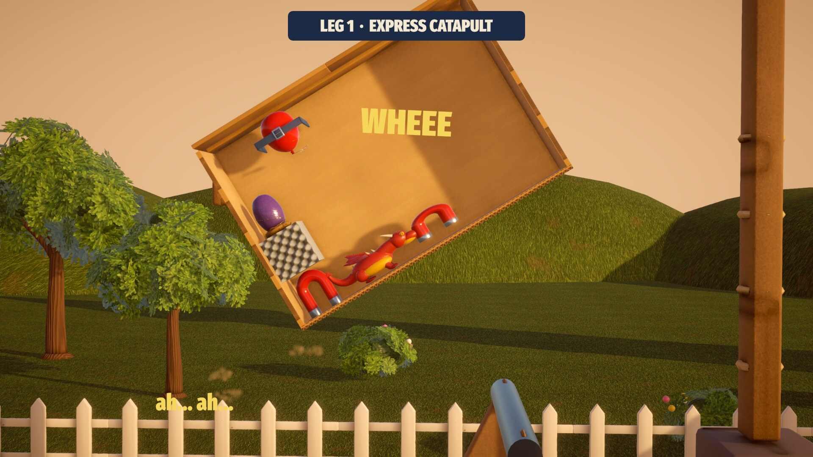 | 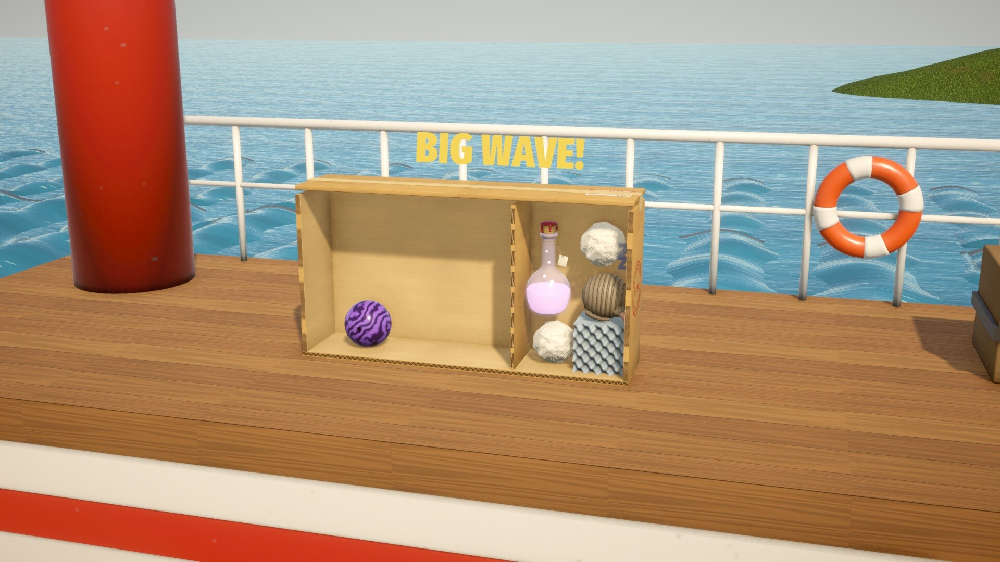 |
| 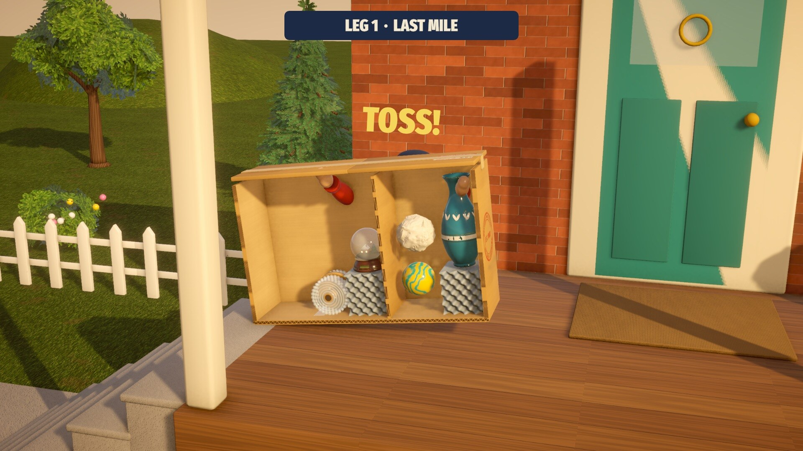 | 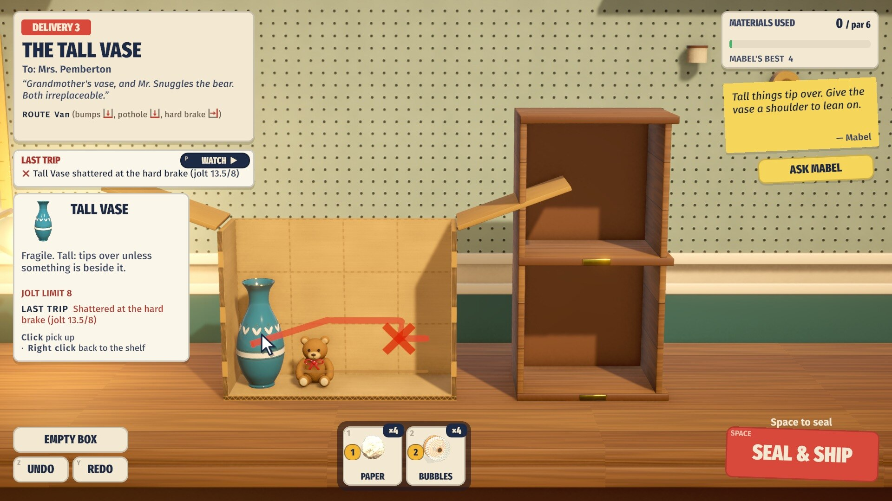 |
|  | 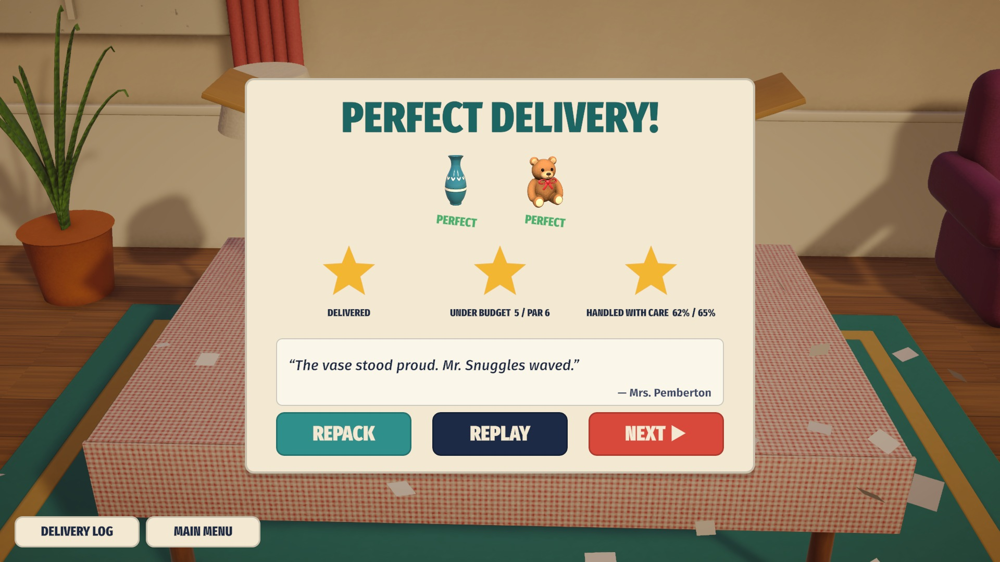 |
|  |  |

## Play it

Download the Linux build from **[Releases](https://github.com/nearbycoder/HandleWithCare/releases/latest)**,
unzip it and run the game:

```sh
unzip HandleWithCare-v0.1.0-linux-x86_64.zip
cd HandleWithCare-v0.1.0-linux-x86_64
./HandleWithCare.x86_64                 # on Wayland, add -force-wayland if the window never appears
```

It needs a 64-bit Linux desktop with working Vulkan or OpenGL drivers. Progress is saved to
`~/.config/unity3d/Mossbury Parcel Post/Handle With Care/`.

The release on GitHub is still v0.1.0 (Linux only). Version 0.2.0 (this README) builds locally for
Linux and macOS but hasn't been published.

**macOS (untested).** `Tools/unity.sh build-mac` makes a universal (Intel + Apple silicon) app, and
`python3 Tools/package.py mac` zips it. Nobody has run it on a Mac yet. The app is not signed with a
Developer ID or notarized, so Gatekeeper will refuse the first launch. Right-click the app and
choose **Open**, or clear the quarantine flag:

```sh
xattr -dr com.apple.quarantine "HandleWithCare.app"
```

**Windows.** `Tools/unity.sh build-windows` is ready, but the Windows Build Support module isn't
installed on the machine this was made on, so no Windows build has been made.

## Build from source

You need **Unity 6000.6.2f1** with Linux Build Support (Mono scripting backend), plus Mac or Windows
Build Support for those players. The art
pipeline needs **Blender 4.5**, and the audio generator needs **Python 3 with numpy** (Blender's bundled
Python works). The trailer tools need **ffmpeg** and **ImageMagick**.

```sh
# open the project in the editor, or build headless:
Tools/unity.sh                  # open in the editor
Tools/unity.sh build-linux      # batch build -> Builds/Linux/HandleWithCare.x86_64 (menu: Handle With Care > Build Linux Player)
Tools/unity.sh build-mac        # Builds/Mac/HandleWithCare.app (universal, unsigned)
Tools/unity.sh build-windows    # Builds/Windows/HandleWithCare.exe (not tried: module not installed)
Tools/play.sh                   # run the build windowed at 1920x1080
python3 Tools/package.py        # zip every built player into Builds/Release/ (keeps permissions)
```

The builds set the version (0.2.0), the bundle id (`com.nearbycoder.handlewithcare`) and the app
icon, which `blender -b -P ArtSource/make_textures.py -- icon` draws into `Assets/Icons/AppIcon.png`.

`Tools/unity.sh` passes through the editor path in `$UNITY` (default `~/Unity/Hub/Editor/6000.6.2f1/Editor/Unity`).
On distributions that ship only `libxml2.so.16`, it can load a `libxml2.so.2` copy from `Tools/.libs/`.

**Regenerate the assets.** Every generator is deterministic, and its output is committed, so this is
only needed after changing a script:

```sh
blender -b -P ArtSource/build_assets.py -- items boxes station stages   # models -> Assets/Resources/Models,
                                                                        # baked PBR maps -> Textures/Baked (~40 min)
blender -b -P ArtSource/build_assets.py -- items --preview /tmp/prev     # plus Cycles contact sheets for review
blender -b -P ArtSource/make_textures.py                                # kraft, tape, labels, stamps, tileable surfaces
python3 ArtSource/make_audio.py                                         # every sound effect and music loop
```

**Validate and test.**

```sh
Tools/simcheck.sh check         # every delivery: reference packing valid, delivered, under par, 3-star,
                                # deterministic; an items-only packing must fail; the full hint is 3-star;
                                # Mabel's best is a stored 3-star packing at or under par
Tools/simcheck.sh hints         # print Mabel's hint notes for every delivery
Tools/simcheck.sh map 3 "t..." "vb.." "vppp"   # simulate any packing and print the timeline
Tools/simcheck.sh solve 7       # parallel local search for cheap / three-star packings (used to set pars)
Tools/simcheck.sh explore 21    # random item-only packings: how many get delivered (should be none)
Tools/autopilot.sh              # the built player plays all 25 references through the real packing code
                                # and checks each outcome and hash against the validator
Tools/hintpilot.sh              # Ask Mabel on all 25: click through every hint, build what the ghosts show,
                                # expect three stars and the validator's hash; then the finale opens Overtime
Tools/padpilot.sh               # gamepad only (a virtual pad at 1280x800): title to delivery 2, dividers,
                                # undo/redo, turning Ember, Ask Mabel, pause, settings and the delivery log;
                                # PlayStation prompts with a virtual DualShock 4 and the BUTTON ICONS setting;
                                # then LARGER TEXT: bigger on four screens, and nothing that fit overflows;
                                # every hint note of every delivery at a readable size, off and on
Tools/savepilot.sh              # seven launches on one save, saving switched on: settings, progress and an
                                # unsealed box survive a restart; a half-written save comes back from the
                                # backup; garbage with no backup starts fresh; MY BEST after a restart;
                                # START OVER (cancel, then confirm: settings and a copy of the old save kept);
                                # a save in v0.1.0's format gets MY BEST from its last boxes shipped
Tools/tour.sh                   # screenshots of the menus and a delivery played with real input events,
                                # then the whole retry loop (R, Space, Enter, P) with the keyboard only,
                                # undo/redo with German, French and Russian key labels swapped in, and
                                # Esc backing out of every menu
```

The self-tests write their screenshots and player logs to `Logs/selftest/<name>/` (gitignored) and fail
if a screenshot never reaches the disk. They also point `XDG_CONFIG_HOME` into that folder, so the
player's Unity prefs and any save stay there, and they fail if the real
`~/.config/unity3d/Mossbury Parcel Post/` changed during the run.

**Recreate the trailer and README media.**

```sh
Tools/trailer/capture.sh                # plays Tools/trailer/shots.txt in the built player (~6 min)
python3 Tools/trailer/make_trailer.py   # docs/media/trailer.mp4
python3 Tools/trailer/make_media.py     # docs/media/teaser.webp, docs/media/trailer-poster.jpg
```

## Project structure

```
Assets/
  Scripts/Sim/        Deterministic simulation in pure C# (no UnityEngine): items and quirks, packing
                      rules, routes and kinematics, the physics world, recording, the 25 levels
  Scripts/Game/       Game flow, packing controller, journey player, unboxing, save, autopilot,
                      trailer director
  Scripts/Visuals/    Box and piece views, journey stages, camera rig, post-processing, particles,
                      quirk and trail overlays
  Scripts/UI/         Runtime-built uGUI + TextMeshPro: HUD, menus, tutorial
  Scripts/Audio/      Pooled sound effects, music crossfades and ducking
  Editor/             Project setup, import settings, build script (Linux, macOS, Windows)
  Icons/              App icon (generated)
  Resources/          Models (FBX from Blender), textures, audio, fonts, template materials
ArtSource/            Blender and numpy generators, with .blend sources in ArtSource/blend
  hwc_lib.py          Modelling helpers: Unity-space bmesh primitives, voxel-fused organic shapes,
                      FBX export, Cycles preview renders
  pbr.py              Procedural physically based materials and the Cycles bake to albedo, normal
                      and mask maps
  items.py boxes.py station.py stages.py   Model builders
  build_assets.py     Builds, bakes and exports every model
  make_textures.py    Kraft, corrugation, tape, labels, stamps, tileable PBR surface sets, clouds
  make_audio.py       Every sound effect and music loop
Tools/
  SimCheck/           .NET console app that compiles Assets/Scripts/Sim: validator, explorer, solver
  trailer/            Shot list, capture wrapper, trailer edit and README media scripts
  *.sh                Editor launcher, build, play, autopilots, screenshot tours
  package.py          Zips the built players for a release
docs/                 Design brief, design plan, README media
```

## Tech highlights

- **Deterministic 2D physics in pure C#.** The simulation runs at 240 Hz on axis-aligned bodies with
  sequential impulses, on a fixed-tick route of box kinematics. It doesn't use Unity's physics, and
  it's placement-order independent, so the same packing always gives bit-identical results. A whole
  journey simulates in a few tens of milliseconds on a worker thread while the tape gun is still
  sweeping. The journey, replay, director camera, unboxing, review and last-trip trails all
  play back that one recording.
- **Jolts with materials.** Impacts are measured per item and softened by what the item hits. Walls
  are hard, paper is a little softer, bubble wrap much softer, foam softest. Quirks (sleepers,
  magnets, walkers, heat, fire, hopping, buoyancy, spikes) are rules on top of the same step.
- **A validator and a solver that share the game's code.** `Tools/SimCheck` compiles the exact
  simulation sources into a .NET console app. It proves every delivery has a valid three-star
  reference packing, checks that an items-only packing fails, and checks determinism. Its parallel
  local search was used to set each delivery's par. The built player's autopilot replays the same
  references through the real input path and compares hashes.
- **Everything is generated.** Every 3D model is built by Python in Blender from bevelled primitives
  and voxel-fused organic shapes. Each gets procedural PBR materials (glazed ceramic, plush, chrome,
  car paint, timber, foliage...), baked in Cycles to albedo, normal and mask maps, which URP's Lit
  shader reads directly. The remaining textures are generated by script in Blender, and every sound
  and music loop is synthesized with numpy. The UI is built at runtime in code, with no prefabs.
- **A director camera that knows the future.** The camera reads the recorded incidents ahead of
  time, so it can slow down, lean in and shake before a failure happens. The replay has three
  camera modes.
- **A trailer mode in the game.** `-hwcTrailer` plays a data-driven shot list with real mouse and
  keyboard events. It renders on a fixed 30 fps clock (`Time.captureDeltaTime`) and records the
  game's own audio mix with `AudioRenderer`, so the trailer is reproducible frame for frame.

## Credits and tooling

Made for this project: all code, the Blender model scripts, the procedural textures, the
synthesized music and sound effects, and the trailer.

Third-party:

- **Fira Sans** and **Fira Sans Compressed** (The Mozilla Foundation, Telefonica S.A., bBox Type GmbH
  and Carrois Corporate GbR), under the SIL Open Font License 1.1 (`Assets/Resources/Fonts/Fira-OFL.txt`).
- **Liberation Sans** (bundled with TextMesh Pro), under the SIL Open Font License 1.1
  (`Assets/TextMesh Pro/Fonts/LiberationSans - OFL.txt`).
- **Unity packages**: Universal Render Pipeline, Input System, uGUI and TextMesh Pro, under the Unity
  Companion License.

Tools: Unity 6, Blender 4.5 (with Cycles), Python and numpy, .NET 8 (SimCheck), ffmpeg and
ImageMagick (trailer and README media).

## Status and known issues

Version 0.2.0 is complete and playable from start to finish: 25 deliveries (20 in the story, 5 in
Overtime), every one validated solvable with three stars.

- **Platforms.** Linux is built and tested. The macOS build is made and checked on Linux (a
  universal x86_64 + arm64 binary, the bundle id, version and icon are all in place) but has
  **not been run on a Mac**, and it is unsigned and not notarized. Windows has a build entry point
  but no build, because the module isn't installed. A WebGL build isn't planned: the simulation
  runs on a worker thread and the textures are BC7.
- **Performance.** The frame rate on a dedicated GPU has not been measured. On the shared machine it
  was built on, other programs kept the GPU about 97% busy. The game's own main thread takes about 9 ms
  per frame during a journey (`Tools/play.sh -hwcFps` logs this). Settings has a High Quality Graphics
  switch that drops MSAA, render scale, shadow range and SSAO for slower GPUs, and VSync with a
  frame-rate limit (30, 60, 120 or unlimited) for laptops and handhelds.
- **Foliage.** Trees and bushes use alpha-tested leaf cards over sculpted canopies. Up close they look
  more like good models than real foliage. Dash the courier is a simple jointed figure animated in
  code.
- **Audio.** The synthesized audio was checked by measurement (levels, spectrum, loudness), not by a
  dedicated listening pass.
- **Difficulty.** Pars sit two or three above the cheapest known three-star cost, so the
  under-budget star stays friendly; Mabel's best is the tighter target. A Prickly Situation no
  longer has a divider (one divider used to solve it): the wall between the spikes and the balloon
  has to be spike-proof padding. Mabel's best comes from a randomised local search, so a cheaper
  packing may still exist.
- **Input.** Mouse and keyboard, or a gamepad. The gamepad support is tested with a virtual pad
  (`Tools/padpilot.sh`, at the Steam Deck's 1280×800), not yet with a physical controller or on a
  Steam Deck. PlayStation prompts are tested with the Input System's DualShock 4 layout on a virtual
  device; how a real DualShock or DualSense reports itself on Linux depends on the driver, so AUTO may
  still show Xbox letters there (GAMEPAD BUTTON ICONS fixes that). There's no touch support. Pausing when the window loses focus is tested by calling
  the focus handler, not by really switching windows. Letter shortcuts follow the keyboard layout's
  labels. That is tested by swapping in German, French and Russian labels (`Tools/tour.sh`), not
  with a real non-US keyboard; this Linux player does report the layout ('us') and the key names.
- **Text size.** LARGER TEXT grows small text by up to 30%, but only as far as its box allows. Mabel's
  sticky note is the exception: it gets taller instead, so her hints are never smaller than 19 units
  (about 25 with LARGER TEXT). A tall note can overlap the top-right shelf cubby at 16:9; it lets
  clicks through and fades while the pointer is over it.
- **Saves.** Crash safety is tested by damaging the save between launches (`Tools/savepilot.sh`), not
  by cutting the power mid-write. Only the most recent backup is kept. A save from v0.1.0 kept only
  the last box shipped for each delivery: the first time each bench opens, that box is simulated again
  and becomes MY BEST if it still delivers (with the stars it really earns). A box that fails, or that
  later balance changes made illegal, is not kept, so MY BEST for those appears after the next
  delivered trip.

## License

No license has been chosen yet, so all rights are reserved for now. The fonts keep their own licenses
(above).
